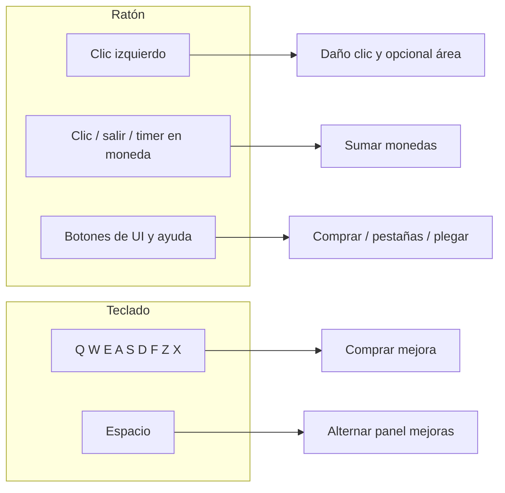

# Controles e interacción del jugador

Este documento describe **cómo el usuario interactúa** con Bogosoft-TP: ratón, teclado y elementos de la interfaz. Las acciones de teclado están definidas en el mapa de entradas de Godot (`project.godot`, sección `[input]`) y se procesan en `Scripts/Upgrades_Panel.gd` (`_unhandled_key_input`).

---

## Ratón

### Clic izquierdo en el campo de juego

- **Atacar (clicker):** cada pulsación crea un área de daño puntual (`Click_Damage`) en la posición del cursor. Si un enemigo (`Area2D` en el grupo `enemy`) solapa esa área, recibe daño según la mejora de **daño de clic**.
- **Área de daño adicional:** si compraste **tamaño de área de clic** (stat distinto de cero), en el mismo clic se crea también una instancia de `Click_Area`, escalada según esa mejora, que puede dañar a varios enemigos solapados (daño de **área de clic**).
- El cursor en pantalla es un sprite personalizado (`Mouse.tscn`): al pulsar y soltar se reproducen animaciones de “clic”.

### Interacción con monedas

Las monedas son `Area2D` en el grupo `coin`. El jugador puede hacerlas volar hacia el contador de monedas (y sumar su valor) de **tres** maneras:

1. **Clic** sobre la moneda (`InputEventMouseButton` en la forma de la moneda).
2. **Salir con el cursor** del área de la moneda (`mouse_exited`): útil si la moneda está bajo el puntero y se quiere “empujar” hacia fuera para recogerla.
3. **Automático:** cada moneda tiene un `Timer`; al vencerse el tiempo, se dispara la misma recogida sin clic.

Al completarse el movimiento hacia la UI, se actualizan monedas y el estado de los botones de mejora.

### Interfaz (solo ratón, además del teclado)

- **Pestañas del panel de mejoras:** botones para cambiar entre *Clicks*, *Units* y *Defenses* (también cambian el `TabContainer`).
- **Botón deslizable “Upgrades”:** muestra u oculta más contenido del panel moviendo el panel en vertical; el texto alterna entre ▼ y ▲.
- **Icono / botón de información** de cada mejora (textura): abre un cuadro de ayuda con título y descripción.
- **Botón de compra** de cada fila de mejora: mismo efecto que la tecla asociada, si hay monedas y se cumplen las reglas (prerrequisitos, tope de arqueros, etc.).
- **Fin de partida:** botones **Reiniciar** y **Salir** (visibles tras un breve delay).

No hay movimiento del personaje con WASD: el “personaje blanco” es principalmente **presentación**; el combate activo del jugador es el **clic** y las **mejoras**.

---

## Teclado (atajos de compra y panel)

Las teclas disparan la **compra** de la mejora correspondiente (misma lógica que el botón verde de precio). Si no hay monedas suficiente, no se cumple un prerrequisito o la vida ya está llena (reparación), la acción no hace nada.

| Tecla | Acción de entrada (Godot) | Efecto en el juego |
|-------|---------------------------|-------------------|
| **Q** | `upgclick` | Comprar **daño de clic** |
| **W** | `upgarea` | Comprar **tamaño del área de clic** |
| **E** | `upgareadmg` | Comprar **daño del área de clic** (requiere haber comprado tamaño de área; stat de tamaño ≠ 0) |
| **A** | `unlockarcher` | Comprar **+1 arquero** (máximo 4; luego la fila se oculta y aparece +1 flecha) |
| **S** | `upgarchdmg` | Comprar **daño de flecha** (requiere al menos un arquero) |
| **D** | `upgarchas` | Comprar **cadencia de flecha** (menor tiempo entre disparos; requiere arquero) |
| **F** | `upgarchmultishot` | Comprar **+1 flecha por disparo** (solo con los 4 arqueros comprados) |
| **Z** | `upgheal` | **Reparar castillo** (gasta monedas; no hace nada si la vida ya está al máximo) |
| **X** | `upgmaxlife` | Comprar **vida máxima del castillo** (cura al máximo y sube el tope) |
| **Barra espaciadora** | `openupgmenu` | **Alterna** el panel de mejoras plegado (mismo efecto que pulsar el botón deslizable del panel) |

### Limitaciones con teclado

- Tras **game over** (vida del castillo en 0), `Upgrades_Panel` **ignora** todas las teclas de mejora y espacio: no se compra nada ni se pliega el menú desde atajos hasta reiniciar.
- Los atajos **no** sustituyen al clic para dañar enemigos ni para recoger monedas manualmente: siguen siendo acciones de **ratón** (salvo la recogida automática por timer).

---

## Resumen visual de flujo

---

## Dónde está implementado

| Interacción | Script principal |
|-------------|------------------|
| Clic → daño | `Scripts/Mouse.gd`, `Scripts/Click_Damage.gd`, `Scripts/Click_Area.gd` |
| Monedas | `Scripts/Coin.gd`, `Scripts/Gold_Coin.gd`, `Scripts/Silver_Coin.gd` |
| Teclas y panel de mejoras | `Scripts/Upgrades_Panel.gd` (`_unhandled_key_input`, botones conectados en `Upgrades_Panel.tscn`) |
| Mapa de teclas | `project.godot` → `[input]` |

Si se añaden teclas nuevas, conviene definir una **Input Map** con nombre claro y enlazarla en `_unhandled_key_input` igual que las acciones existentes.
